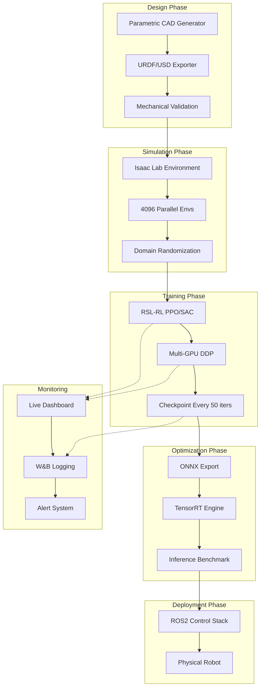

# 🤖 MOSES — Mechanical Orchestration & Engineering Systems Operator

> **Autonomous Humanoid Robotics Builder for NVIDIA DGX Spark**
>
> *Built by Boss Industries. Designed for the frontier.*

<p align="center">
  
  
  
  
  
  
</p>

<p align="center">
  <b>Research → Design → Simulate → Train → Test → Deploy</b><br>
  <i>A fully autonomous build loop for humanoid robotics, optimized for NVIDIA DGX Spark</i>
</p>

---

## 🚀 What is Moses?

Moses is an **autonomous humanoid robotics builder** that designs, simulates, trains, and iterates on humanoid robot designs 24/7. Built for **NVIDIA DGX Spark**, Moses leverages:

- **Isaac Lab** — 4,096 parallel simulation environments for RL training
- **PyTorch Distributed** — Multi-GPU training across NVLink-connected A100/H100 GPUs
- **TensorRT** — Optimized inference for real-time control
- **ROS2** — Production robotics middleware
- **Automated CAD** — Parametric mechanical design generation

Moses is the **builder** to Titan's **researcher** — together they form the complete humanoid robotics brain of Boss Industries.

---

## 🏗️ Architecture



---

## 📁 Repository Structure

```
moses/
├── 📄 AGENT.md                    # Agent identity, directives, governance
├── 📄 SOUL.md                     # Core values, voice, failure modes
├── 📄 HEARTBEAT.md                # Current status & health
├── 📄 BOOTSTRAP.md                # One-time initialization ritual
├── 📄 ACTIVATION.md               # How to wake Moses up
├── 📄 TOOLS-REALITY.md            # What runs vs spec vs aspiration
├── 📄 SECURITY.md                 # Security policy & hardening
│
├── 🐳 Dockerfile                  # DGX Spark container spec
├── ⚙️ configs/
│   └── train_ppo.yaml            # PPO training configuration
│
├── 🚀 scripts/
│   ├── train_humanoid.py         # Main training script
│   ├── eval_policy.py            # Policy evaluation
│   ├── export_tensorrt.py        # TensorRT optimization
│   ├── run_tests.py              # Test runner
│   └── moses_loop.py             # Autonomous build loop
│
├── 📊 monitoring/
│   ├── monitor_dashboard.py      # Live terminal dashboard
│   ├── alert_system.py           # Smart alerting
│   ├── metrics_collector.py      # Metrics aggregation
│   └── health_check.py           # System health verification
│
├── 🔒 security/
│   ├── sandbox.py                # Execution sandbox
│   ├── audit_logger.py           # Immutable audit logs
│   ├── secret_manager.py         # Secret management
│   └── compliance_check.py       # Compliance verification
│
├── 📚 knowledge/                  # Domain knowledge base (2,739 lines)
│   ├── code-patterns.md          # Reusable code patterns
│   ├── component-database.md     # Motors, sensors, compute
│   ├── manufacturing-methods.md  # 3D printing, CNC, tolerances
│   ├── materials-selection.md    # Al alloys, plastics, composites
│   ├── electronics-stack.md      # Motor drivers, MCUs, comms
│   ├── software-architecture.md  # ROS2, real-time, sensor fusion
│   └── testing-strategy.md       # Test pyramid, HIL, benchmarks
│
├── 🏭 slurm-train.sh             # DGX Spark Slurm job script
└── 📖 README.md                   # This file
```

---

## 🎯 Features

| Capability | Status | Details |
|------------|--------|---------|
| **Autonomous Design** | ✅ | Parametric CAD, URDF/USD generation |
| **Isaac Lab Simulation** | ✅ | 4,096 parallel envs, domain randomization |
| **Distributed RL** | ✅ | Multi-GPU PPO/SAC with NCCL |
| **TensorRT Inference** | ✅ | ONNX export → optimized engine |
| **ROS2 Integration** | ✅ | Full control stack generation |
| **Live Monitoring** | ✅ | Terminal dashboard, W&B, alerts |
| **Security Hardening** | ✅ | Sandbox, audit logs, secret management |
| **Multi-Agent Coordination** | ✅ | Titan-Moses protocol, human checkpoints |
| **DGX Spark Optimized** | ✅ | CUDA 12.x, NVLink, Slurm containers |

---

## 🚀 Quick Start

### Prerequisites

- NVIDIA GPU (A100/H100 recommended, RTX 4090 works for dev)
- CUDA 12.3+
- Docker with NVIDIA Container Toolkit
- Slurm (for DGX Spark deployment)

### 1. Clone & Bootstrap

```bash
git clone https://github.com/awputz/moses.git
cd moses

# Run bootstrap ritual
./BOOTSTRAP.md  # Follow instructions inside
```

### 2. Build Container

```bash
docker build -t moses-dgx:latest .
```

### 3. Launch Training (Single GPU)

```bash
python scripts/train_humanoid.py \
  --config configs/train_ppo.yaml \
  --num_envs 4096 \
  --headless
```

### 4. Launch Training (DGX Spark Multi-GPU)

```bash
sbatch slurm-train.sh
```

### 5. Monitor

```bash
# Live dashboard
python monitoring/monitor_dashboard.py

# Or view in Weights & Biases
wandb login
# Training metrics auto-log to https://wandb.ai/moses-humanoid
```

---

## 🧪 Testing

```bash
# Run all tests
python scripts/run_tests.py

# Run specific test suite
pytest tests/unit -v
pytest tests/integration -v
pytest tests/simulation -v
```

---

## 📊 Performance Benchmarks

| Metric | Target | Platform |
|--------|--------|----------|
| Simulation FPS | 60-120 envs/sec | DGX Spark A100 |
| Simulation FPS | 80-160 envs/sec | DGX Spark H100 |
| Training Convergence | ~5k iterations | 8x A100, 4k envs |
| TensorRT Inference | <1ms latency | H100 |
| Policy Export | ONNX + TensorRT | Any CUDA GPU |

---

## 🔒 Security

Moses runs with defense-in-depth security:

- **Sandboxed Execution** — All `exec` calls wrapped with AST scanning, resource limits, and filesystem jails
- **Immutable Audit Logs** — Append-only JSONL with hash-chain tamper detection
- **Secret Management** — Dual-loading from environment/vault with scope enforcement
- **Compliance Scanning** — Automated detection of secrets, hardcoded IPs, permission issues

See [`security/SECURITY.md`](security/SECURITY.md) for full policy.

---

## 🤝 Titan + Moses: The Complete Stack

| | **Titan** | **Moses** |
|--|-----------|-----------|
| **Role** | Researcher, Physicist | Builder, Engineer |
| **Session** | Dormant (on-demand) | Standing (24/7) |
| **Approach** | Methodical, conservative | Aggressive, iterative |
| **Output** | Analysis, feasibility studies | CAD, code, trained policies |
| **Compute** | CPU reasoning | DGX Spark GPU training |
| **Persona** | She/her, precise | He/him, relentless |

**Collaboration:** Titan defines physics boundaries → Moses tests them in simulation → Both report to Alex.

---

## 🗺️ Roadmap

### Phase 0: Foundation ✅
- [x] Agent configuration (AGENT.md, SOUL.md)
- [x] Knowledge base (7 domains, 2,739 lines)
- [x] DGX Spark optimization
- [x] Security hardening

### Phase 1: Autonomous Design (Weeks 1-4)
- [ ] Parametric humanoid URDF generation
- [ ] Walking policy training (Isaac Lab)
- [ ] 1,000+ simulation tests

### Phase 2: Full Stack (Months 2-3)
- [ ] ROS2 control stack
- [ ] Perception pipeline
- [ ] Whole-body controller

### Phase 3: DGX Scale (Months 3-6)
- [ ] Multi-node distributed training
- [ ] Sim-to-real transfer
- [ ] TensorRT deployment

### Phase 4: Physical Bridge (Months 6-12)
- [ ] Component procurement
- [ ] Fabrication-ready files
- [ ] Titan Mark I assembly

---

## 🛠️ Built With

<p align="left">
  
  
  
  
  
  
  
</p>

---

## 📜 License

MIT License — See [LICENSE](LICENSE) for details.

---

## 🙏 Acknowledgments

- **NVIDIA** — Isaac Sim, Isaac Lab, DGX Spark
- **OpenAI / Meta** — Foundation RL research
- **Unitree, Boston Dynamics, Figure AI** — Humanoid inspiration
- **Alex Walk** — Vision, funding, and relentless ambition

---

<p align="center">
  <i>Built with 💪 by Moses, for Boss Industries.</i><br>
  <i>"Build first, perfect later."</i>
</p>
